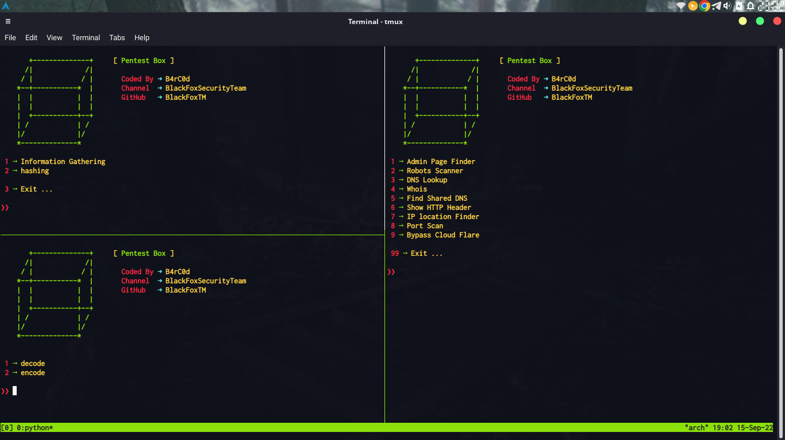

# PentestBox
All-in-one tool for penetration testing

This tool is a collection of **penetration testing** and **information gathering** tools and **brute force**

# Features

- **information gathering**
  - Admin Page Finder
  - DNS Lookup
  - Robots Scanner
  - Find Shared DNS
  - Show HTTP Header
  - IP location Finder
  - Port Scan
  - Whois
  - Revers IP
  - Full Lookup
 
- **hashing**
    - decode (Hash Crack)
    - encode

# Tool photo



# Installation

Instructions on how to install *PentestBox*
```
git clone https://github.com/B4rC0d/PentestBox.git
```
Go to the directory
```
cd PentestBox
```
install requirements
```
pip install -r requirements.txt
```

See Help
```
python3 PentestBox.py
```
